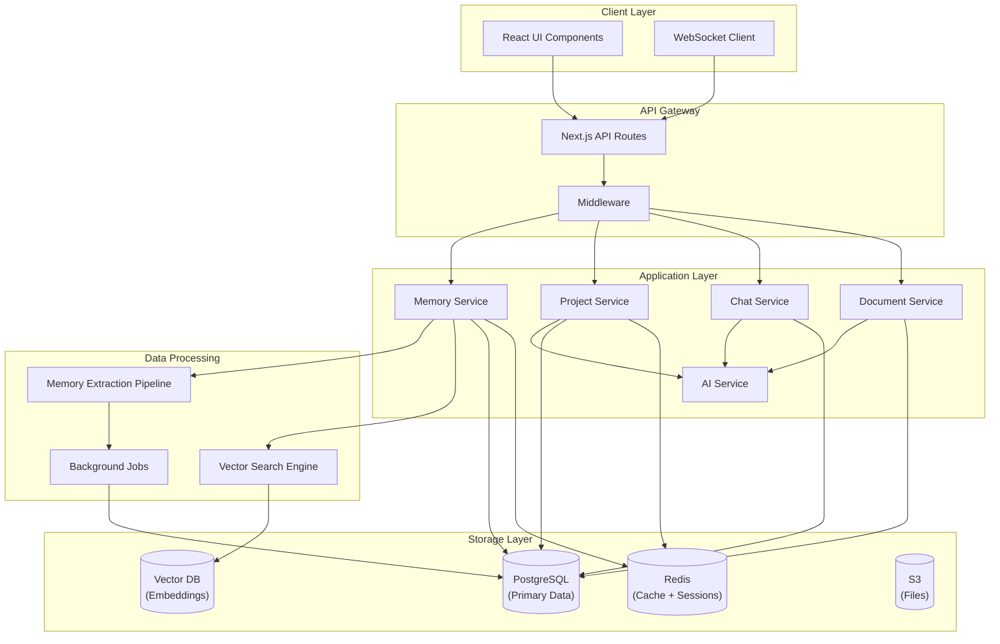
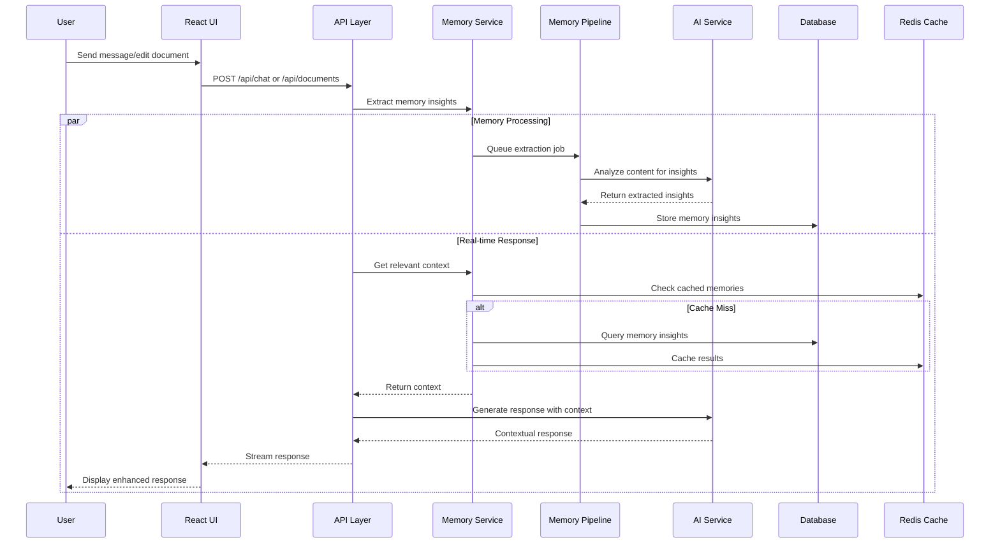

# Memory & Project Features - Technical Requirements Document

## Executive Summary

This document outlines the implementation of intelligent memory and project management features for our AI knowledge platform. These features will transform user interactions by providing contextual awareness, intelligent suggestions, and organized project workflows that significantly enhance productivity and user engagement.

## Business Rationale

### Why This Feature Matters

**Market Positioning**: Memory and project features are becoming table stakes in AI platforms. ChatGPT's memory feature has shown significant user adoption, and competitors like Claude Projects are gaining traction.

**User Pain Points Addressed**:
- Context loss between conversations requiring users to re-explain background
- Difficulty organizing related chats and documents
- Lack of intelligent suggestions based on past interactions
- No project-based collaboration workflows

**Competitive Advantage**:
- First-to-market with integrated memory + document versioning
- Superior multi-tenant project organization
- Advanced Git-like branching for collaborative knowledge work

## Business Impact Analysis

### Revenue Impact
- **Projected ARR Increase**: 25-35% through improved retention and premium feature adoption
- **User Engagement**: Expected 40% increase in session duration
- **Conversion Rate**: 15-20% improvement from free to paid tiers

### Market Opportunity
- **Target Segment**: Knowledge workers, research teams, consultants
- **Market Size**: $2.3B knowledge management software market
- **Competitive Moat**: Unique memory + versioning combination

### Success Metrics
- Memory utilization rate: >60% of active users
- Project creation rate: >30% of teams
- Session length increase: >40%
- Feature satisfaction score: >4.5/5

## Technical Architecture

### System Architecture Overview



### Data Flow Architecture



### Core Components

#### 1. Memory System Database Schema

```sql
-- Memory Insights Table
CREATE TABLE memory_insights (
    id UUID PRIMARY KEY DEFAULT gen_random_uuid(),
    user_id UUID NOT NULL REFERENCES users(id) ON DELETE CASCADE,
    organization_id UUID REFERENCES organizations(id) ON DELETE CASCADE,
    team_id UUID REFERENCES teams(id) ON DELETE CASCADE,
    
    -- Memory Classification
    insight_type VARCHAR(50) NOT NULL CHECK (insight_type IN (
        'preference', 'context', 'skill', 'goal', 'fact', 'relationship'
    )),
    category VARCHAR(100), -- 'communication_style', 'work_preferences', etc.
    
    -- Content Storage
    content JSONB NOT NULL,
    summary TEXT,
    keywords TEXT[],
    
    -- Confidence and Quality
    confidence_score FLOAT CHECK (confidence_score >= 0 AND confidence_score <= 1),
    quality_score FLOAT CHECK (quality_score >= 0 AND quality_score <= 1),
    
    -- Source Tracking
    source_type VARCHAR(20) NOT NULL CHECK (source_type IN (
        'chat', 'document', 'explicit', 'inferred'
    )),
    source_id UUID,
    source_context JSONB,
    
    -- Usage Analytics
    created_at TIMESTAMP WITH TIME ZONE DEFAULT NOW(),
    last_accessed TIMESTAMP WITH TIME ZONE,
    access_count INTEGER DEFAULT 0,
    relevance_decay FLOAT DEFAULT 1.0,
    
    -- Privacy and Lifecycle
    is_active BOOLEAN DEFAULT TRUE,
    expires_at TIMESTAMP WITH TIME ZONE,
    privacy_level VARCHAR(20) DEFAULT 'private' CHECK (privacy_level IN (
        'private', 'team', 'organization', 'public'
    ))
);

-- Indexes for Performance
CREATE INDEX idx_memory_insights_user_type ON memory_insights(user_id, insight_type);
CREATE INDEX idx_memory_insights_org_team ON memory_insights(organization_id, team_id);
CREATE INDEX idx_memory_insights_source ON memory_insights(source_type, source_id);
CREATE INDEX idx_memory_insights_keywords ON memory_insights USING GIN(keywords);
CREATE INDEX idx_memory_insights_content ON memory_insights USING GIN(content);
CREATE INDEX idx_memory_insights_active_score ON memory_insights(is_active, confidence_score DESC);

-- Project Contexts Table
CREATE TABLE project_contexts (
    id UUID PRIMARY KEY DEFAULT gen_random_uuid(),
    project_id UUID NOT NULL, -- References team_id or organization_id
    project_type VARCHAR(20) NOT NULL CHECK (project_type IN ('team', 'organization')),
    
    -- Context Data
    context_type VARCHAR(50) NOT NULL,
    summary TEXT NOT NULL,
    key_topics JSONB DEFAULT '[]'::jsonb,
    active_goals JSONB DEFAULT '[]'::jsonb,
    recent_activities JSONB DEFAULT '[]'::jsonb,
    
    -- Metrics
    activity_score FLOAT DEFAULT 0,
    collaboration_score FLOAT DEFAULT 0,
    
    -- Timestamps
    created_at TIMESTAMP WITH TIME ZONE DEFAULT NOW(),
    updated_at TIMESTAMP WITH TIME ZONE DEFAULT NOW(),
    last_activity_at TIMESTAMP WITH TIME ZONE,
    
    UNIQUE(project_id, context_type)
);

CREATE INDEX idx_project_contexts_project ON project_contexts(project_id, project_type);
CREATE INDEX idx_project_contexts_activity ON project_contexts(last_activity_at DESC);

-- Memory Relationships Table
CREATE TABLE memory_relationships (
    id UUID PRIMARY KEY DEFAULT gen_random_uuid(),
    source_memory_id UUID NOT NULL REFERENCES memory_insights(id) ON DELETE CASCADE,
    target_memory_id UUID NOT NULL REFERENCES memory_insights(id) ON DELETE CASCADE,
    relationship_type VARCHAR(50) NOT NULL,
    strength FLOAT CHECK (strength >= 0 AND strength <= 1),
    created_at TIMESTAMP WITH TIME ZONE DEFAULT NOW(),
    
    UNIQUE(source_memory_id, target_memory_id, relationship_type)
);

-- Memory Embeddings for Semantic Search
CREATE TABLE memory_embeddings (
    memory_id UUID PRIMARY KEY REFERENCES memory_insights(id) ON DELETE CASCADE,
    embedding VECTOR(1536), -- OpenAI ada-002 dimensions
    model_version VARCHAR(50) NOT NULL,
    created_at TIMESTAMP WITH TIME ZONE DEFAULT NOW()
);

CREATE INDEX idx_memory_embeddings_vector ON memory_embeddings 
USING ivfflat (embedding vector_cosine_ops) WITH (lists = 100);
```

#### 2. Enhanced Existing Tables

```sql
-- Add memory hooks to existing tables
ALTER TABLE chats ADD COLUMN IF NOT EXISTS memory_extracted BOOLEAN DEFAULT FALSE;
ALTER TABLE chats ADD COLUMN IF NOT EXISTS memory_context_ids UUID[];
ALTER TABLE chats ADD COLUMN IF NOT EXISTS context_summary TEXT;

ALTER TABLE documents ADD COLUMN IF NOT EXISTS memory_extracted BOOLEAN DEFAULT FALSE;
ALTER TABLE documents ADD COLUMN IF NOT EXISTS memory_context_ids UUID[];
ALTER TABLE documents ADD COLUMN IF NOT EXISTS knowledge_tags TEXT[];

ALTER TABLE message_v2 ADD COLUMN IF NOT EXISTS memory_triggers JSONB;
ALTER TABLE message_v2 ADD COLUMN IF NOT EXISTS context_used JSONB;
ALTER TABLE message_v2 ADD COLUMN IF NOT EXISTS memory_feedback JSONB;

-- Project Enhancement
ALTER TABLE teams ADD COLUMN IF NOT EXISTS project_type VARCHAR(50) DEFAULT 'general';
ALTER TABLE teams ADD COLUMN IF NOT EXISTS project_status VARCHAR(20) DEFAULT 'active';
ALTER TABLE teams ADD COLUMN IF NOT EXISTS project_metadata JSONB DEFAULT '{}'::jsonb;
```

### Memory Collection Strategy

**Real-time Extraction**:
- Hook into existing chat message processing
- Document save/update triggers
- Explicit user memory commands

**Background Processing**:
- Batch analysis of conversation patterns
- Document content summarization
- Cross-reference relationship building

**Storage Optimization**:
- JSONB for flexible memory structure
- Indexed search on key fields
- Redis caching for hot memory data

### Integration Points

#### Existing Architecture Leverage
- **Multi-tenancy**: Use existing organization/team structure
- **Document System**: Integrate with current versioning
- **Chat System**: Enhance with memory context injection
- **Permissions**: Extend current visibility controls

#### New Workflow Integration
```typescript
// Memory Collection Hook
export async function collectMemoryFromMessage(
  message: Message,
  chatContext: Chat
) {
  const insights = await extractInsights(message.content);
  await storeMemoryInsights(insights, {
    userId: message.userId,
    organizationId: chatContext.organizationId,
    teamId: chatContext.teamId,
    sourceType: 'chat',
    sourceId: message.id
  });
}

// Memory Retrieval for Context
export async function getRelevantMemory(
  userId: string,
  context: ProjectContext
): Promise<MemoryInsight[]> {
  return await queryMemoryWithSemanticSearch({
    userId,
    projectId: context.projectId,
    limit: 10,
    relevanceThreshold: 0.7
  });
}
```

## Development Strategy

### Phase 1: Foundation (Weeks 1-2)
**Goal**: Basic memory collection and project structure

**Deliverables**:
- Database schema implementation
- Memory collection hooks in chat/document flows
- Basic project workspace UI
- Memory privacy controls

**Resources**: 2 full-stack developers, 1 designer

### Phase 2: Intelligence (Weeks 3-4)
**Goal**: Smart features and AI integration

**Deliverables**:
- Context-aware AI responses
- Smart document suggestions
- Memory-powered chat enhancements
- Project analytics dashboard

**Resources**: 2 full-stack developers, 1 AI engineer

### Phase 3: Enhancement (Weeks 5-6)
**Goal**: Advanced features and optimization

**Deliverables**:
- Semantic search implementation
- Advanced project templates
- Memory insights visualization
- Performance optimizations

**Resources**: 1 full-stack developer, 1 AI engineer, 1 DevOps

### Phase 4: Polish (Weeks 7-8)
**Goal**: Production readiness and user experience

**Deliverables**:
- User onboarding flows
- Advanced privacy controls
- Performance monitoring
- Beta user feedback integration

**Resources**: 1 full-stack developer, 1 designer, 1 QA

## Resource Requirements

### Development Team
- **Engineering**: 3 full-stack developers (8 weeks)
- **AI/ML**: 1 AI engineer (6 weeks)
- **Design**: 1 UI/UX designer (4 weeks)
- **DevOps**: 1 engineer (2 weeks)
- **QA**: 1 tester (2 weeks)

**Total Engineering Cost**: ~$120,000 (8 weeks)

### Infrastructure
- **Database**: Additional 20% storage capacity
- **Compute**: Vector search infrastructure (~$500/month)
- **Caching**: Redis cluster expansion (~$200/month)
- **Monitoring**: Enhanced observability tools (~$100/month)

**Monthly Infrastructure Increase**: ~$800

### Third-party Services
- **Vector Database**: Pinecone or similar (~$300/month)
- **AI Processing**: Additional OpenAI/Anthropic credits (~$1000/month)
- **Analytics**: Enhanced tracking tools (~$200/month)

## Technical Implementation Details

### Memory Processing Pipeline

```typescript
// Memory Extraction Service
class MemoryExtractionService {
  async processMessage(message: Message): Promise<MemoryInsight[]> {
    const insights = [];
    
    // Extract user preferences
    const preferences = await this.extractPreferences(message.content);
    insights.push(...preferences);
    
    // Extract contextual information
    const context = await this.extractContext(message.content);
    insights.push(...context);
    
    // Extract goals and objectives
    const goals = await this.extractGoals(message.content);
    insights.push(...goals);
    
    return insights;
  }
  
  private async extractPreferences(content: string): Promise<MemoryInsight[]> {
    // AI-powered preference extraction
    const response = await this.aiService.analyze(content, {
      task: 'extract_preferences',
      categories: ['communication_style', 'work_preferences', 'tools', 'formats']
    });
    
    return response.preferences.map(pref => ({
      type: 'preference',
      content: pref,
      confidence: pref.confidence,
      source: 'chat'
    }));
  }
}
```

### Project Context Management

```typescript
// Project Context Service
class ProjectContextService {
  async updateProjectContext(
    projectId: string,
    newActivity: Activity
  ): Promise<void> {
    const context = await this.getProjectContext(projectId);
    
    // Update key topics
    context.keyTopics = await this.mergeTopics(
      context.keyTopics,
      newActivity.topics
    );
    
    // Update active goals
    context.activeGoals = await this.updateGoals(
      context.activeGoals,
      newActivity.goals
    );
    
    // Generate new summary
    context.summary = await this.generateSummary(context);
    
    await this.saveProjectContext(context);
  }
}
```

## Security & Privacy

### Data Protection
- **Encryption**: All memory data encrypted at rest and in transit
- **Access Controls**: Granular permissions based on organization/team membership
- **Data Retention**: Configurable memory retention policies
- **User Control**: Complete memory deletion capabilities

### Privacy Features
- **Memory Visibility**: Users can see all stored memories
- **Selective Deletion**: Remove specific memory insights
- **Opt-out Options**: Disable memory collection entirely
- **Audit Logs**: Track memory access and modifications

## Performance Considerations

### Scalability Strategy
- **Horizontal Scaling**: Partition memory data by organization
- **Caching**: Multi-layer caching strategy (Redis + CDN)
- **Async Processing**: Background memory extraction
- **Database Optimization**: Proper indexing and query optimization

### Performance Targets
- **Memory Retrieval**: <100ms for context injection
- **Memory Storage**: <500ms for insight extraction
- **Project Loading**: <200ms for project context
- **Search Performance**: <300ms for semantic search

## Risk Assessment

### Technical Risks
- **Data Migration**: Existing data integration complexity
- **Performance Impact**: Memory processing overhead
- **AI Accuracy**: Memory extraction quality

**Mitigation**: Phased rollout, extensive testing, fallback mechanisms

### Business Risks
- **User Adoption**: Feature complexity barrier
- **Privacy Concerns**: Memory data sensitivity
- **Competitive Response**: Fast-follower competition

**Mitigation**: User education, transparent privacy controls, rapid iteration

## Success Criteria

### Technical KPIs
- System uptime: >99.9%
- Memory accuracy: >85%
- Performance targets met: 100%
- Zero data breaches

### Business KPIs
- Feature adoption: >60% of active users
- User satisfaction: >4.5/5
- Revenue impact: >25% ARR increase
- Retention improvement: >20%

## Go-to-Market Strategy

### Launch Phases
1. **Alpha**: Internal team testing (Week 6)
2. **Beta**: Select customer preview (Week 8)
3. **Soft Launch**: Gradual rollout (Week 10)
4. **Full Launch**: Complete feature availability (Week 12)

### Marketing Positioning
- **Primary Message**: "AI that remembers and learns with you"
- **Key Benefits**: Contextual intelligence, organized workflows, collaborative knowledge
- **Target Audience**: Knowledge workers, research teams, consultants

## Conclusion

The Memory & Project features represent a strategic investment in user experience and competitive positioning. With careful implementation following this technical roadmap, we can deliver a differentiated product that significantly enhances user productivity while driving substantial business growth.

The 8-week development timeline, $120K investment, and projected 25-35% ARR increase make this a high-ROI initiative that should be prioritized in our product roadmap.

---

**Document Version**: 1.0  
**Last Updated**: January 2025  
**Next Review**: February 2025  
**Owner**: Engineering & Product Teams